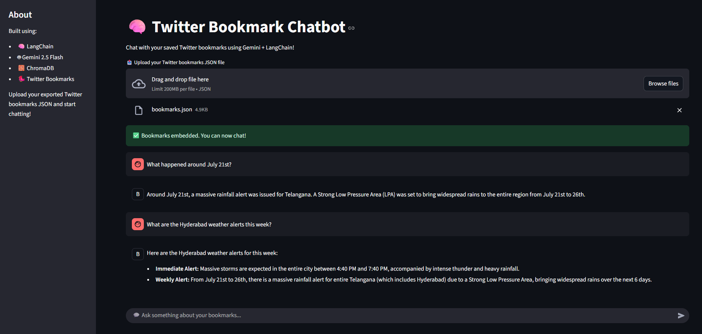
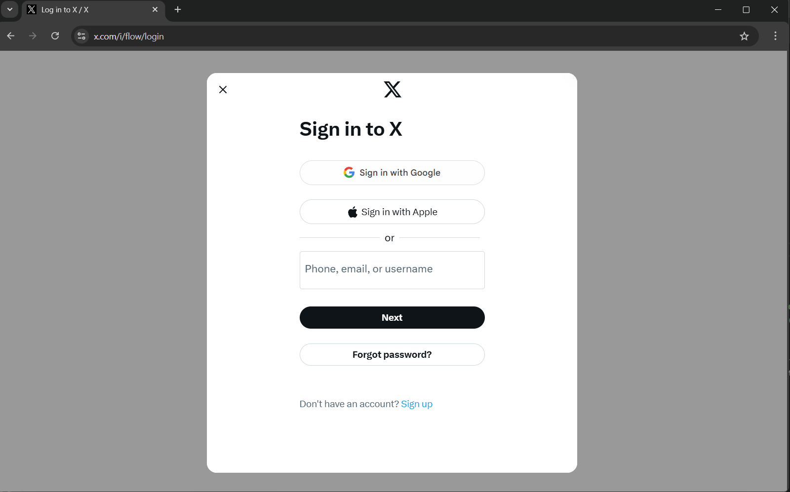

# 🧠 Twitter Bookmark Chatbot

## 🚀 Live Demo

Experience the live application deployed on Render: [https://twitter-bookmark-chatbot.onrender.com](https://twitter-bookmark-chatbot.onrender.com)


## ✨ Project Overview

**Unlock the knowledge in your saved Twitter/X bookmarks!** This project delivers an innovative, privacy-focused AI chatbot that allows you to intelligently converse with your personal collection of bookmarked tweets. It provides an end-to-end pipeline, from secure data acquisition via browser automation to a dynamic conversational experience powered by Google's free Gemini API.

This app combines:

- ✅ Secure, user-initiated scraping with Playwright
- 🧠 Free Gemini-powered embeddings and conversational AI
- 💬 LangChain for robust RAG and conversational memory management
- ⚡ An intuitive Streamlit interface for seamless interaction

Crucially, your data stays private — all processing is done in-memory with no permanent storage on the server, offering an ephemeral and secure way to explore your insights.

---

## 🌟 Key Features

- 🔎 Scrape your Twitter/X bookmarks using a custom Playwright-based scraper
- 💾 Embed and store tweet content using Google Gemini embeddings + ChromaDB
- 💬 Chat with your bookmarks via LangChain's `ConversationalRetrievalChain`
- 🧠 Session-based memory to keep conversation context
- 📁 Local development & Render-ready deployment
- ✅ Secure `.env` support (API keys never hardcoded)

---

## 💡 How It Works (Technical Overview)

The application uses a robust **Retrieval Augmented Generation (RAG)** architecture to enable intelligent, context-aware interactions with your Twitter/X bookmarks.

---

### 🧾 1. Bookmark Scraping (Pre-Step)

- Run `scraper/twitter_scraper.py` locally.
- Uses **Playwright** for browser automation and manual login to Twitter/X.
- Automatically scrolls through your bookmarks and extracts all tweets.
- Saves data as `bookmarks.json`.

---

### 📤 2. Upload & Preprocessing

- Upload the `bookmarks.json` file to the Streamlit app.
- The app extracts tweet text and metadata for embedding.

---

### 🔢 3. Text Splitting & Embedding

- Tweets are chunked using `RecursiveCharacterTextSplitter`.
- Each chunk is embedded using **Google's `embedding-001` model** via the **Gemini API**.

---

### 🗃️ 4. Ephemeral Vector Storage with ChromaDB

- Embeddings + metadata are stored in a **temporary ChromaDB** instance.
- Uses `tempfile.mkdtemp()` to ensure **session-specific, auto-deleting storage**.
- No data is saved permanently — privacy is preserved.

---

### 🧠 5. LangChain Chatbot Initialization

Leveraging LangChain's powerful abstractions (a foundational framework for building LLM applications, including those that might evolve into more complex LangGraph agents), a `ConversationalRetrievalChain` is meticulously set up with:

- 💬 **Gemini 2.5 Flash** (acting as the core LLM for generating responses)
- 📚 **ChromaDB** (serving as the vector store for efficient semantic search over your bookmarked tweets)
- 🧵 **ConversationBufferMemory** (crucial for maintaining session history and enabling multi-turn dialogue)

---

### 🤖 6. Query & Response Flow

- When you ask a question:
  - A vector similarity search finds the most relevant tweets.
  - Tweets + chat history are passed as context to the Gemini LLM.
  - The LLM generates a **rich, contextual answer**.
- Response is displayed in the Streamlit chat interface.

---

✅ **Result:** You get intelligent, personalized answers from your bookmarks — all in real-time, with full privacy.

## ✨ Demo

> Upload your `bookmarks.json` file and chat with your saved tweets in natural language!  
> Try asking questions like:  
> • “What are the Hyderabad weather alerts this week?” 
> • “List all cricket-related tweets” 
> • “What happened around July 21st?”

🔗 **Live app**: [twitter-bookmark-chatbot.onrender.com](https://twitter-bookmark-chatbot.onrender.com)

---



## 📂 Project Structure

```bash
📦 twitter-bookmark-chatbot
├── chatbot/
│   └── agent_langchain.py     # LangChain + Gemini conversational agent
├── embeddings/
│   └── embedder.py            # Embeds tweets with Gemini and stores in ChromaDB
├── scraper/
│   └── twitter_scraper.py     # Playwright-based Twitter bookmark scraper
├── streamlit_ui.py            # Streamlit front-end app
├── .env                       # Gemini API Key (not committed)
├── requirements.txt
└── README.md
```

---

## 🧱 Modular Codebase

Each major feature is self-contained:

| Component         | Description                          |
| ----------------- | ------------------------------------ |
| `scraper/`        | Playwright automation for scraping   |
| `embeddings/`     | Gemini embedding + ChromaDB indexing |
| `chatbot/`        | LangChain conversational agent       |
| `streamlit_ui.py` | Upload UI + pipeline integration     |

✅ Easy to test, extend, and debug.

---

### 🔧 Prerequisites

To run this project locally, make sure you have the following installed:

- **Python 3.9+**  
  Python 3.10.12 is recommended (used in deployment) for full compatibility.

- **Git**  
  Required to clone the repository.

- **Google Gemini API Key**  
  Get your free API key from [Google AI Studio](https://ai.google.dev/).

- **Playwright (Python version)**  
  Used for automating Twitter login and scraping bookmarks.  
  Install it via pip and run `playwright install` to set up browser dependencies.

## 🛠️ Setup Instructions

Follow these steps to set up and run the project locally:

---

### 1. Clone the Repository

```bash
git clone https://github.com/Vinit3116/twitter-bookmark-chatbot.git
cd twitter-bookmark-chatbot
```

### 2. Create a Virtual Environment (Recommended)

```bash
python -m venv venv
source venv/bin/activate  # On Windows: venv\Scripts\activate
```

### 3. Install Python Dependencies

```bash
pip install -r requirements.txt
```

### 4. Install Playwright Browser Drivers

Since the twitter_scraper.py script uses Playwright, install the necessary browser drivers:

```bash
playwright install
```

## 📥 Obtaining Your Twitter Bookmarks (Crucial Pre-step)

⚠️ **This step must be completed _before_ you run the Streamlit app.**

You’ll use the provided `scraper/twitter_scraper.py` script to generate the `bookmarks.json` file.

### Steps:

### 1. **Navigate to the `scraper` directory:**

```bash
cd scraper
```

### 2: Run the Scraper Script

```bash
python twitter_scraper.py
```

- A **Playwright-controlled browser window** will open.

- 🔐 **Manual Login Required:** Log into your Twitter/X account manually in the opened browser. Complete any CAPTCHA or 2FA challenges if prompted.

- 🔄 The script will automatically navigate to your **bookmarks page** (`https://x.com/i/bookmarks`) and begin scrolling to load all your saved tweets.

✅ **Screenshot Tip:**



### Step 3: Allow Scrolling & Scraping

- 🌀 The script **automatically scrolls** through your bookmarks page and collects tweets.

- 🧾 It prints **progress logs** in your terminal (e.g., `Loaded 15 tweets...`).

- 🛑 The process stops either after a **maximum number of attempts** or when **no new tweets** are detected.

✅ **Screenshot Tip:**  
Scrolling activity during Scraping:


### Step 4: Move `bookmarks.json` to the Project Root

Once the scraping is complete, move the `bookmarks.json` file from the `scraper/` directory to the root of your project so the Streamlit app can access it easily.

```bash
mv bookmarks.json ../bookmarks.json
cd ..
```


### 🔑 Setting Up Your Gemini API Key

1. Create a `.env` file in the **root directory** of your project.

2. Add the following line to the file:

   ```env
   GOOGLE_API_KEY="your_google_gemini_api_key_here"
   ```

   💡 **Replace** the placeholder with your actual API key obtained from [Google AI Studio](https://ai.google.dev/).

🔐 This `.env` file is excluded from Git tracking via `.gitignore` for security.

### ▶️ Running the Application Locally

### 1. Ensure you're in the **project root directory**:

```
    cd twitter-bookmark-chatbot
```

### 2. Start the Streamlit application:

```
    streamlit run streamlit_ui.py
```

### 3. Visit [http://localhost:8501](http://localhost:8501) in your web browser.

## 📚 Usage Guide

### Step-by-Step:

#### 📤 Upload Bookmarks

Use the file uploader in the app to upload your `bookmarks.json` file.

#### 🔄 Embedding Process

The app embeds your tweets using **Gemini embeddings** and loads them into a temporary **ChromaDB**.

✅ You'll see a message like:

> "✅ Bookmarks embedded. You can now chat!"

#### 💬 Start Chatting

You can now ask natural language questions such as:

> • “What are the Hyderabad weather alerts this week?” 
> • “List all cricket-related tweets” 
> • “What happened around July 21st?”

#### 🔁 Ongoing Context

Thanks to **LangChain's conversational memory**, your chat history is preserved for follow-up questions during the session.

---

## 🌐 Deployment

This application is designed for **stateless PaaS platforms** like [Render](https://render.com), with a focus on **ephemeral, per-session storage**.

### 🚀 Live Demo

[https://twitter-bookmark-chatbot.onrender.com](https://twitter-bookmark-chatbot.onrender.com)

### 📁 Key Deployment Files

- `requirements.txt`

### 🔐 Security First

All embedding data is handled using:

```python
tempfile.mkdtemp()
```

## 🛠️ Technologies Used

| Area               | Tool/Service              |
| ------------------ | ------------------------- |
| Frontend UI        | Streamlit                 |
| LLM Integration    | LangChain                 |
| Language Model     | Gemini (gemini-2.5-flash) |
| Embeddings         | Gemini (embedding-001)    |
| Vector DB          | ChromaDB                  |
| Scraper Automation | Playwright (Python)       |
| Deployment         | Render                    |
| Env Management     | python-dotenv             |

## 🔮 Future Enhancements

- 🔁 **Twitter API Integration** (to replace manual scraping)
- 🔐 **User login and persistent memory**
- 🧠 **LangGraph-based agent reasoning**

## 📞 Contact

**Your Name**: **Vinit Patel**  
**GitHub**: [https://github.com/Vinit3116](https://github.com/Vinit3116)  
**LinkedIn**: [https://www.linkedin.com/in/vinitpatel31](https://www.linkedin.com/in/vinitpatel31)
